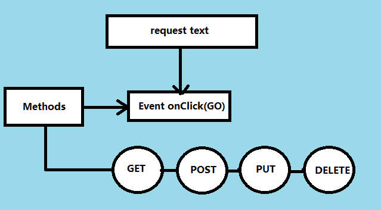

# Lab 26 - React

## Project : RESTy

## Authoer : Ahmed Abu Samaan
## PR :-
[PR](https://github.com/AhmedAbuSamaan-401-advanced-javascript/restyNew/pull/8)

## Deployed link :
[Deployed](https://wizardly-elion-a1ba8f.netlify.app/)

## Installion

npx create-react-app resty
Server running at http://localhost:3000/

## run Application

npm start

## UML Diagram

